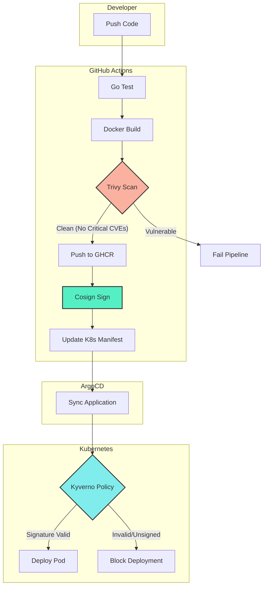

# Secure Software Supply Chain Pipeline

This project implements a **NIST-compliant Secure Software Supply Chain** pipeline. It demonstrates an automated, end-to-end workflow for building, securing, and deploying containerized applications on Kubernetes.

The core objective is to prevent unverified or vulnerable code from running in production by enforcing **image signing** and **vulnerability scanning** gates.

## 🍌 Architecture Overview

The pipeline follows a "Build -> Scan -> Sign -> Enforce" workflow.



## 🚀 Components

*   **Application**: Minimal Go web service (Distroless image).
*   **CI Pipeline**: GitHub Actions (Build, Scan, Sign, Update).
*   **Container Registry**: GitHub Container Registry (GHCR).
*   **Security Scanning**: [Trivy](https://github.com/aquasecurity/trivy) (CVE detection).
*   **Signing**: [Cosign](https://github.com/sigstore/cosign) (Keyless OIDC signing).
*   **CD Controller**: [ArgoCD](https://argo-cd.readthedocs.io/) (GitOps).
*   **Policy Engine**: [Kyverno](https://kyverno.io/) (Admission Controller).

## 🛠️ Prerequisites

*   **Kubernetes Cluster**: A running cluster (v1.24+).
*   **ArgoCD**: Installed in the `argocd` namespace.
*   **Kyverno**: Installed in the `kyverno` namespace.
*   **GitHub Token**: `GITHUB_TOKEN` (automatically provided in Actions).

## 📦 Installation & Deployment

### 1. Setup the Cluster
Ensure ArgoCD and Kyverno are installed:
```bash
# Install Kyverno
kubectl create -f https://github.com/kyverno/kyverno/releases/download/v1.11.1/install.yaml

# Install ArgoCD
kubectl create namespace argocd
kubectl apply -n argocd -f https://raw.githubusercontent.com/argoproj/argo-cd/stable/manifests/install.yaml
```

### 2. Apply the Manifests
Deploy the Kyverno policy and the ArgoCD Application:
```bash
kubectl apply -f k8s/kyverno-policy.yaml
kubectl apply -f k8s/argocd-app.yaml
```

### 3. Trigger the Pipeline
Push a change to the `main` branch to trigger the CI/CD pipeline.
1.  **Builds** the Go app.
2.  **Scans** for vulnerabilities (fails on CRITICAL/HIGH).
3.  **Pushes** to GHCR.
4.  **Signs** the image using GitHub OIDC (Keyless).
5.  **Updates** the `k8s/deployment.yaml` with the new image tag.

### 4. GitOps Sync
ArgoCD detects the change in the repo and syncs the deployment to the `secure-apps` namespace.

### 5. Verification
Check that the pod is running and verified:
```bash
kubectl get pods -n secure-apps
kubectl get deployment -n secure-apps secure-api -o yaml | grep "kyverno.io/verify-images"
```
You should see an annotation indicating the image signature was verified.

## 🔒 Security Policies

### Vulnerability Scanning
The pipeline uses **Trivy** to scan the image.
*   **Policy**: Fails if `CRITICAL` or `HIGH` severity vulnerabilities are found.
*   **Fix**: Update the base image or dependencies (e.g., upgrade Go version).

### Image Signing (Keyless)
We use **Cosign** with GitHub's OIDC provider.
*   **Issuer**: `https://token.actions.githubusercontent.com`
*   **Subject**: This repository and workflow.
*   **Enforcement**: Kyverno blocks any image in the `secure-apps` namespace that is not signed by this specific workflow.

## 🏃‍♂️ Running Locally

```bash
# Run the app
go run main.go

# Build the image
docker build -t secure-api .

# Test the endpoints
curl http://localhost:8080/
```
